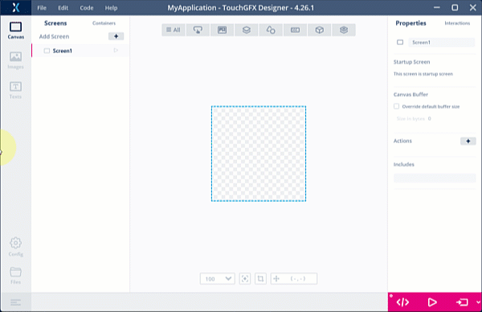
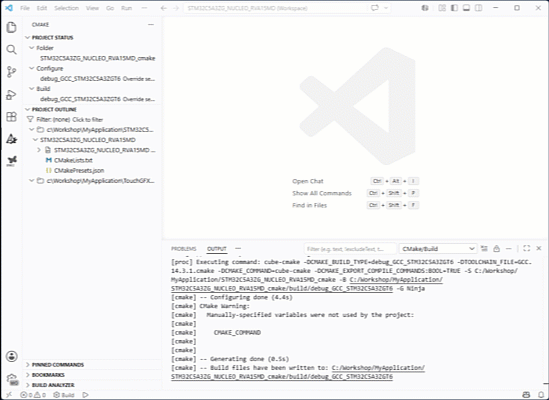

# ST entry level GUIs Demo Workshop <!-- omit from toc -->

This repository contains all the requirements needed to follow the hands-on part of the workshop, during the live session or afterwards.

---

## Table of contents <!-- omit from toc -->
- [1. Prerequisites](#1-prerequisites)
  - [1.1. Hardware](#11-hardware)
  - [1.2. Software](#12-software)
    - [1.2.1. TouchGFX Designer](#121-touchgfx-designer)
    - [1.2.2. VS Code®](#122-vs-code)
- [2. Sanity Check](#2-sanity-check)
  - [2.1 Create a TouchGFX project and import a demo](#21-create-a-touchgfx-project-and-import-a-demo)
    - [2.1.1 Launch TouchGFX Designer and create an empty project using the NUCLEO-C5A3ZG template](#211-launch-touchgfx-designer-and-create-an-empty-project-using-the-nucleo-c5a3zg-template)
    - [2.1.2 Import an existing demo](#212-import-an-existing-demo)
    - [2.1.3. Build and launch the PC simulator](#213-build-and-launch-the-pc-simulator)
  - [2.2 Build project in VS Code®](#22-build-project-in-vs-code)
    - [2.2.1 Open workspace in VS Code®:](#221-open-workspace-in-vs-code)
    - [2.2.2 Setup the project](#222-setup-the-project)
    - [2.2.3 Build the project](#223-build-the-project)
    - [2.2.4 Assemble the hardware boards](#224-assemble-the-hardware-boards)
    - [2.2.5 Program the application](#225-program-the-application)
- [3. Hands-on](#3-hands-on)

## 1. Prerequisites

### 1.1. Hardware
  [🔼Top](#table-of-contents)  

The hardware setup consists in 2 boards:

  |[NUCLEO-C5A3ZG](https://www.st.com/en/evaluation-tools/nucleo-c5a3zg.html#sample-buy)|[RVA15MD (v.1.1A or higher)](https://riverdi.com/product/015-nucleo-64)|
  |:---------------:|:--------:|
  | STM32C5A3ZGT6 MCU with FPU | 1.54 inches SPI display with touch capabilities |
  | Cortex&reg;-M33 running at 144Mhz | 240 per 240 pixels - 16-bits color depth |
  | 1 MBytes internal FLASH - 256 KBytes RAM | 8 MBytes SPI NOR FLASH |
  |||
  |[Datasheet](https://www.st.com/resource/en/datasheet/stm32c5a3zg.pdf)|[Datasheet](https://download.riverdi.com/RVA15MD-NUC64A/DS_RVA15MD-NUC64A_Rev.1.2.pdf?_gl=1*dizkq7*_gcl_au*MTk3Mjc5NDAxMC4xNzc0NTM4MTQ1LjIxMjAxNTE1NjcuMTc3NjI0ODk5Mi4xNzc2MjQ5MDAy)|

### 1.2. Software

#### 1.2.1. TouchGFX Designer
  [🔼Top](#table-of-contents)  
  
  The current version is the 4.26.1.

  The TouchGFX Designer installer cannot be downloaded in a standalone way, it is included in the TouchGFX expansion pack for STM32CubeMX.

  - Download [X-CUBE-TOUCHGFX](https://www.st.com/en/embedded-software/x-cube-touchgfx.html)

  - Extract the installer `X-CUBE-TOUCHGFX\4.26.1\Utilities\PC_Software\TouchGFXDesigner\TouchGFX-4.26.1.msi`  
   

- Run the installer and prefer the default installation folder on `C:\` drive.  

#### 1.2.2. VS Code&reg;
  [🔼Top](#table-of-contents)  

- Download and install VS Code&reg; from [Visual Studio Code Download](https://code.visualstudio.com/download)

- Install the extension [STM32CubeIDE for Visual Studio Code](https://marketplace.visualstudio.com/items?itemName=stmicroelectronics.stm32-vscode-extension)
  - Open VS Code&reg; 

  - Create a new `Workshop` profile. This step is recommended if you use VS Code&reg; for other purpose, in this dedicated profile you will install only the packages needed for STM32 programming and avoid any kind of incompatibility between packages.  
     

  - Open Extensions panel and search for "STM32CubeIDE extension for VSCode", install, dependencies will get installed automatically  
     

> Usefull links on VS Code&reg; extension  
> [Guide](https://github.com/stm32-hotspot/Guide_STM32CubeIDE_for_Visual_Studio_Code)  
> [Official user Manual](https://www.st.com/resource/en/user_manual/um3512-stm32cube-for-visual-studio-code-installation-guide-stmicroelectronics.pdf)  

## 2. Sanity Check
Before starting the hands-on, let's check that your setup is functional.
If you manage to complete all the following steps you will be ready not only to follow the hands-on part of this workshop but also start prototyping on STM32C5!

### 2.1 Create a TouchGFX project and import a demo
  [🔼Top](#table-of-contents)  
  
#### 2.1.1 Launch TouchGFX Designer and create an empty project using the NUCLEO-C5A3ZG template  

  

#### 2.1.2 Import an existing demo  
  - Use the `Edit->Import->GUI` menu  
  - click on `Demos`  
  - Select the `Knob Prime` demo  
   
  
#### 2.1.3. Build and launch the PC simulator  
  - Click on the pink arrow button at the bottom-right of the Designer window:   
  - This will automatically generate the code, build the PC simulator and launch it  
    Note that a debug window will show up in from of the main window, this window automatically appears when the function **touchgfx_printf()** is called in the code (see Model.cpp file).  
  The call to **touchgfx_printf()** is only meant for PC Simulator debugging and is ignore when building for the target  
   

### 2.2 Build project in VS Code&reg;
  [🔼Top](#table-of-contents)  
  
#### 2.2.1 Open workspace in VS Code&reg;:  
  - You may either double-click on the `C:\Workshop\MyApplication\STM32C5A3ZG_NUCLEO_RVA15MD.code-workspace`, this will open a new VS Code&reg; windows (check the profile) or drag-and-drop the file in an existing VS Code&reg; set to the profile created earlier  
  - This will create a new workspace containing 2 folders  

      `STM32C5A3ZG_NUCLEO_RVA15MD_cmake` (main project)  
      `TouchGFX` (TouchGFX specific source code)  
  - Some popups will then appear on the bottom-right side of the windows during project automatic discovery, you can ignore them, we will force the project setup in the next step  
   

#### 2.2.2 Setup the project  
  - Click on the `STM32C5A3ZG_NUCLEO_RVA15MD_cmake`  
  - Open the Command Palette using menu `View->Command Palette..` or `Crtl + Shift + P`  
  - Type `STM32cube: Set up STM32Cube Projects`  
  - Select `STM32C5A3ZG_NUCLEO_RVA15MD_cmake` in the center-top menu  
  - Click on Save and Close button  
   

#### 2.2.3 Build the project  
  - Click on CMake tab on the right side of the window  
  - In `Project Outline`, select `STM32C5A3ZG_NUCLEO_RVA15MD` and click on the `Build` icon  
  - This will automatically build the entire project, including TouchGFX code  
   

#### 2.2.4 Assemble the hardware boards  
  Plug the Riverdi display on the NUCLEO-C5A3ZG morpho connector, once plugged the text on each board with the same orientation should be read in the same direction, see below.  
     

#### 2.2.5 Program the application  
  - Plug the board  
  - Click on the `Load and Debug` tab on the left side  
  - Click on `Start Debugging` or type `F5`  
  - Once stopped in main function, click on `Continue` (center-top toolbar) or type `F5`, if the board screen turns to red, sanity check is successfull!  
   

## 3. Hands-on
  [🔼Top](#table-of-contents)  
  
  Follow this link [Hands-on](./hands_on_part.md)
